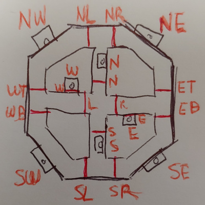
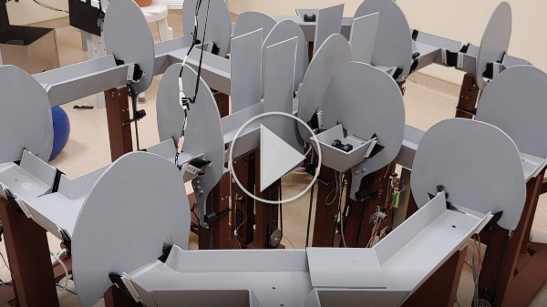

# Octupus maze
Controller for a behavioral task dependent on video tracking. Track subject with a webcam, open/close gates and trigger rewards/tones to guide behavior while logging and syncing with an external data acquisition system (e.g. electrophysiology) in a choice task.



## Two-choice task
Refer to the maze diagram. Subject starts at the N or S arms of the maze and takes a reward. According to a contingency table, chooses to or is forced to take a left or a right turn, for a reward. Then either starts a new trial at the starting point or chooses to go to the opposite side of the maze.

## Set-shift task
Refer to the maze diagram. Subject starts at the N or S arms of the maze and takes a reward. According to a contingency table, chooses to or is forced to take a left or a right turn, to then choose a feeder on the south or north halves of the maze. Then starts a new trial at the starting point or chooses to go to the opposite side of the maze.

## Prerequisites
* [MATLAB][MATLAB] (last tested with R2018a)
* [Webcam support for MATLAB][WebcamSupport]
* Octupus maze.

## Installation
* Install MATLAB
	* Download library from repository and place the MATLAB folder under Documents folder.
	* Create/modify Documents/MATLAB/startup.m and put `addpath('Tools');`
	
## Getting Started
* Plug in an Arduino Mega 2560 and identify the port id (e.g. 'COM4').
* Install the firmware using Arduino/upload-firmware.vbs
* Choose one of the available cameras listed with `webcamlist` by it's index (e.g. 1 for first camera, 2 for second, etc.)
* Execute one of the examples:

```matlab
obj = TwoChoice('COM4', 1);
```

```matlab
obj = SetShift('COM4', 1);
```

[](https://drive.google.com/file/d/1SfYUz2UevaKT23juDb3fbgnZFelnYLQy/view?usp=sharing)

The control programs were written in MATLAB, using an object oriented approach to maintain behavioral states effectively.
Timing of behavioral events is produced using timers or classes that run timers.
Operations in actuators such as servomotors (doors) or pinch valves (feeders) are done using an Arduino micro-controller, which runs a firmata like firmware blind to the behavioral task.
Behavioral states are created and updated in the main class of the task and some classes are used to aid code development:
	Bridge - Interfaces with the Arduino to read/write hardware IO states.
	Camera/Tracker/VirtualTracker - Interfaces with the Camera to read images or the position of the subject in the maze and trigger events associated to virtual zones.
	UI/Image/Line - Display images and lines and reads mouse and keyboard states.
	Delay - Handle timing in feeders.

As with every object oriented program, the starting point is the constructor of the class, which is has the same name as the file.
Most of the code is documented and you can read it by looking within the code or by typing `help <class-name>` or `help <class-name>.<method-name>` in the MATLAB prompt.

## Version History
### 0.1.0
* Initial Release: Library and example code

## License
© 2018 [Leonardo Molina][Leonardo Molina]

This project is licensed under the [GNU GPLv3 License][LICENSE.md].

[Leonardo Molina]: https://github.com/leomol
[MATLAB]: https://www.mathworks.com/downloads/
[WebcamSupport]: https://www.mathworks.com/hardware-support/matlab-webcam.html
[LICENSE.md]: LICENSE.md